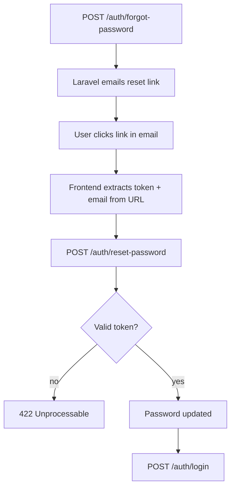

## Forgot Password

Standard email-based password recovery using Laravel's built-in [Password facade](https://laravel.com/docs/master/passwords).


### Setup

#### 1. Install the feature

The forgot password flow is automatically installed when selected during `auth:setup`.

#### 2. Ensure your User model uses `CanResetPassword`


```php
use Illuminate\Auth\Passwords\CanResetPassword;

class User extends Authenticatable
{
    use CanResetPassword;
}
```

#### 3. Ensure the `password_reset_tokens` table exists

Laravel ships this migration by default. If it's missing, run:

```bash
php artisan migrate
```

#### 4. Configure the reset URL

Laravel sends the reset token inside a URL pointing to your frontend. Add this inside the `boot()` method of your `AppServiceProvider`:

```php
use Illuminate\Auth\Notifications\ResetPassword;
use Illuminate\Support\Facades\Config;
use App\Models\User;

public function boot(): void
{
    ResetPassword::createUrlUsing(function (User $user, string $token): string {
        return Config::string('app.password_reset_url') . '?token=' . $token . '&email=' . urlencode($user->email);
    });

    // ... rest of boot()
}
```

Add the corresponding env variable to your `.env` and `.env.example`:

```env
PASSWORD_RESET_URL=https://your-frontend.com/reset-password
```

And expose it in `config/app.php`:

```php
'password_reset_url' => env('PASSWORD_RESET_URL'),
```

#### 5. Define routes

```php
use Lightit\Authentication\App\Controllers\ForgotPasswordController;
use Lightit\Authentication\App\Controllers\ResetPasswordController;

Route::prefix('auth')->group(static function () {
    Route::post('forgot-password', ForgotPasswordController::class);
    Route::post('reset-password', ResetPasswordController::class);
});
```

---

### Flow

1. `POST /auth/forgot-password`
   - Body: `{ "email": "..." }`
   - Returns: `200` always — no user enumeration
   - Laravel generates a token, stores it hashed in `password_reset_tokens`, and emails a reset link to the user

2. User clicks the link in their email
   - Frontend extracts `token` and `email` from the URL query params
   - Frontend displays a "set new password" form

3. `POST /auth/reset-password`
   - Body: `{ "token": "...", "email": "...", "password": "...", "password_confirmation": "..." }`
   - Returns: `200` on success
   - Returns: `422` if token is invalid or expired

4. User logs in normally via `POST /auth/login` with the new password
   - If 2FA is enabled, the existing login pipeline will issue a 2FA challenge as usual



---

### Token Details

- Stored **hashed** in the `password_reset_tokens` table — never in plain text
- Expires after **60 minutes** by default (configurable via `config/auth.php` → `passwords.users.expire`)
- **One-time use** — deleted immediately after a successful reset
