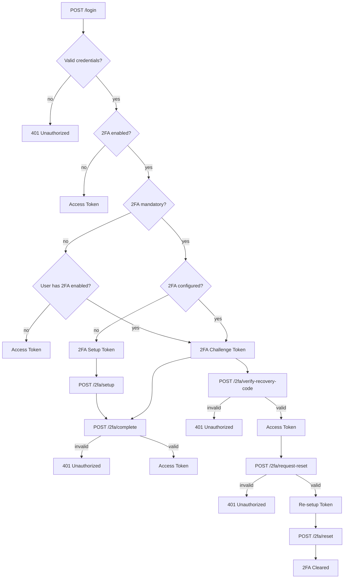

## Google Two-Factor Authentication (2FA)

Enhance account security by enabling Two-Factor Authentication (2FA) using [antonioribeiro/google2fa-laravel](https://github.com/antonioribeiro/google2fa-laravel).

> [!NOTE]
> 2FA support is included at the structural level, but enforcement is not applied by default.

> [!TIP]
> You're free to define how and when 2FA is enforced. Common strategies include two-step login, single-step login, 2FA on sensitive actions, or trusted device recognition. The exact behavior will depend on your project's requirements.

> This package provides the base structure and middleware to support 2FA. Implementation details—such as 2FA token lifetime, logout behavior, or device trust logic—must be defined within your application logic.

### Setup

#### 1. Install the package

The 2FA package is automatically installed when selected during `auth:setup`.

#### 2. Extend your User model

Your `User` model must extend `TwoFactorAuthenticatable`:

```php
<?php

use Lightit\Authentication\Domain\TwoFactorAuthenticatable;

class User extends TwoFactorAuthenticatable
{
    // Your traits and methods
}
```

#### 3. Update casts

Add the following casts to your model to ensure proper encryption and date handling:

```php
protected function casts(): array
{
    return [
        // ...
        self::TWO_FACTOR_AUTH_SECRET_COLUMN_NAME => 'encrypted',
        self::TWO_FACTOR_AUTH_ACTIVATED_AT_COLUMN_NAME => 'immutable_datetime',
    ];
}
```

#### 4. Ensure `UnauthorizedException` exists

The 2FA stubs depend on `Lightit\Shared\App\Exceptions\Http\UnauthorizedException`. If your app doesn't have it yet, create it:

```php
<?php

declare(strict_types=1);

namespace Lightit\Shared\App\Exceptions\Http;

class UnauthorizedException extends HttpException
{
    /**
     * An HTTP status code.
     */
    protected int $status = 401;

    /**
     * An error code.
     */
    protected string $errorCode = 'unauthorized';
}
```

#### 5. Configure the authentication guard

Follow the guard configuration from your chosen driver — see [JWT setup](jwt.md#3-update-environment-and-config) or [Sanctum setup](sanctum.md#3-update-environment-and-config).

#### 6. Define 2FA-related routes

```php
use Lightit\Authentication\App\Controllers\CompleteTwoFactorAuthenticationController;
use Lightit\Authentication\App\Controllers\DisableTwoFactorAuthenticationController;
use Lightit\Authentication\App\Controllers\RegenerateRecoveryCodesController;
use Lightit\Authentication\App\Controllers\ResetTwoFactorAuthenticationController;
use Lightit\Authentication\App\Controllers\SetupTwoFactorAuthenticationController;
use Lightit\Authentication\App\Controllers\RequestTwoFactorResetController;
use Lightit\Authentication\App\Controllers\VerifyRecoveryCodeController;

// Note: apply rate limiting to `complete`, `verify-recovery-code`, and your login route to prevent brute-force attacks
Route::prefix('2fa')->group(static function (): void {
    Route::post('setup', SetupTwoFactorAuthenticationController::class);
    Route::post('complete', CompleteTwoFactorAuthenticationController::class);
    Route::post('verify-recovery-code', VerifyRecoveryCodeController::class);
    Route::post('reset', ResetTwoFactorAuthenticationController::class);

    Route::middleware('auth')->group(static function (): void {
        Route::post('disable', DisableTwoFactorAuthenticationController::class);
        Route::post('regenerate-recovery-codes', RegenerateRecoveryCodesController::class);
        Route::post('request-reset', RequestTwoFactorResetController::class);
    });
});
```

---

### Flow

**First-time setup (mandatory 2FA or user-initiated):**

1. `POST /login`
   - Body: `{ "email": "...", "password": "..." }`
   - Returns: `{ access_token, token_type: "setup_required", expires_in }`
2. `POST /2fa/setup`
   - Bearer: setup token
   - Returns: `{ qr, secret, recovery_codes[] }`
3. `POST /2fa/complete`
   - Bearer: setup token
   - Body: `{ "one_time_password": "..." }`
   - Returns: `{ access_token, token_type: "Bearer", expires_in }`

**Subsequent logins (2FA already configured):**

1. `POST /login`
   - Body: `{ "email": "...", "password": "..." }`
   - Returns: `{ access_token, token_type: "verification_required", expires_in }`
2. `POST /2fa/complete`
   - Bearer: challenge token
   - Body: `{ "one_time_password": "..." }`
   - Returns: `{ access_token, token_type: "Bearer", expires_in }`

**Login with a recovery code (lost authenticator):**

1. `POST /login`
   - Body: `{ "email": "...", "password": "..." }`
   - Returns: `{ access_token, token_type: "verification_required", expires_in }`
2. `POST /2fa/verify-recovery-code`
   - Bearer: challenge token
   - Body: `{ "recovery_code": "..." }`
   - Returns: `{ access_token, token_type: "Bearer", expires_in, remaining_recovery_codes }`

**Reset 2FA (lost authenticator, using a recovery code to regain access):**

1. `POST /login`
   - Body: `{ "email": "...", "password": "..." }`
   - Returns: `{ access_token, token_type: "verification_required", expires_in }`
2. `POST /2fa/verify-recovery-code`
   - Bearer: challenge token
   - Body: `{ "recovery_code": "..." }`
   - Returns: `{ access_token, token_type: "Bearer", expires_in, remaining_recovery_codes }`
3. `POST /2fa/request-reset`
   - Bearer: real access token
   - Body: `{ "password": "..." }`
   - Returns: `{ access_token, token_type: "reset_required", expires_in }`
4. `POST /2fa/reset`
   - Bearer: reset token
   - Returns: `{ data: { message } }`

**Regenerate recovery codes:**

1. `POST /2fa/regenerate-recovery-codes`
   - Bearer: real access token
   - Body: `{ "password": "..." }`
   - Returns: `{ data: { recovery_codes[] } }`

**Disable 2FA:**

1. `POST /2fa/disable`
   - Bearer: real access token
   - Body: `{ "password": "..." }`
   - Returns: `{ data: { message } }`
   - Returns `403 Forbidden` if `google2fa.mandatory` is `true`



---
