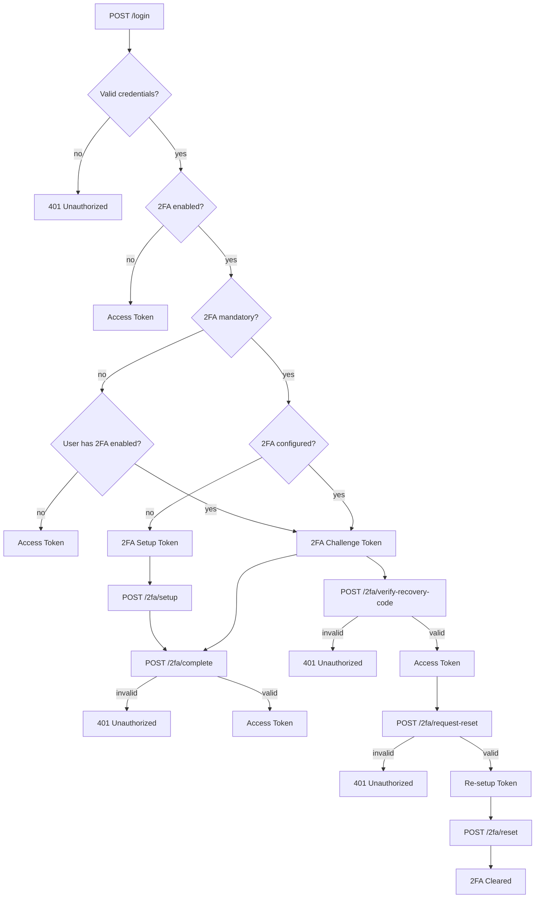

## Google Two-Factor Authentication (2FA)

Enhance account security by enabling Two-Factor Authentication (2FA) using [antonioribeiro/google2fa-laravel](https://github.com/antonioribeiro/google2fa-laravel).

> [!NOTE]
> 2FA support is included at the structural level, but enforcement is not applied by default.

> [!TIP]
> You're free to define how and when 2FA is enforced. Common strategies include two-step login, single-step login, 2FA on sensitive actions, or trusted device recognition. The exact behavior will depend on your project's requirements.

> This package provides the base structure and middleware to support 2FA. Implementation details—such as 2FA token lifetime, logout behavior, or device trust logic—must be defined within your application logic.

### Setup

#### 1. Install the package

The 2FA package is automatically installed when selected during `auth:setup`.

#### 2. Extend your User model

Your `User` model must extend `TwoFactorAuthenticatable`:

```php
<?php

use Lightit\Authentication\Domain\TwoFactorAuthenticatable;

class User extends TwoFactorAuthenticatable
{
    // Your traits and methods
}
```

#### 3. Update casts

Add the following casts to your model to ensure proper encryption and date handling:

```php
protected function casts(): array
{
    return [
        // ...
        self::TWO_FACTOR_AUTH_SECRET_COLUMN_NAME => 'encrypted',
        self::TWO_FACTOR_AUTH_ACTIVATED_AT_COLUMN_NAME => 'immutable_datetime',
    ];
}
```

#### 4. Configure the authentication guard

Follow the guard configuration from your chosen driver — see [JWT setup](jwt.md#3-update-environment-and-config) or [Sanctum setup](sanctum.md#3-update-environment-and-config).

#### 5. Define 2FA-related routes

```php
use Lightit\Authentication\App\Controllers\CompleteTwoFactorAuthenticationController;
use Lightit\Authentication\App\Controllers\DisableTwoFactorAuthenticationController;
use Lightit\Authentication\App\Controllers\RegenerateRecoveryCodesController;
use Lightit\Authentication\App\Controllers\ResetTwoFactorAuthenticationController;
use Lightit\Authentication\App\Controllers\SetupTwoFactorAuthenticationController;
use Lightit\Authentication\App\Controllers\RequestTwoFactorResetController;
use Lightit\Authentication\App\Controllers\VerifyRecoveryCodeController;

Route::prefix('2fa')->group(static function (): void {
    Route::post('setup', SetupTwoFactorAuthenticationController::class);
    Route::post('complete', CompleteTwoFactorAuthenticationController::class);
    Route::post('verify-recovery-code', VerifyRecoveryCodeController::class);
    Route::post('reset', ResetTwoFactorAuthenticationController::class);

    Route::middleware('auth')->group(static function (): void {
        Route::post('disable', DisableTwoFactorAuthenticationController::class);
        Route::post('regenerate-recovery-codes', RegenerateRecoveryCodesController::class);
        Route::post('request-reset', RequestTwoFactorResetController::class);
    });
});
```

---

### Flow

**First-time setup (mandatory 2FA or user-initiated):**

1. `POST /login` → returns a challenge token (`token_type: "setup_required"`)
2. `POST /2fa/setup` with the challenge token as Bearer → returns QR code, secret, and recovery codes
3. `POST /2fa/complete` with the challenge token as Bearer + `one_time_password` → returns a real access token

**Subsequent logins (2FA already configured):**

1. `POST /login` → returns a challenge token (`token_type: "verification_required"`)
2. `POST /2fa/complete` with the challenge token as Bearer + `one_time_password` → returns a real access token

**Login with a recovery code (lost authenticator):**

1. `POST /login` → returns a challenge token
2. `POST /2fa/verify-recovery-code` with the challenge token as Bearer + `recovery_code` → consumes the code (one-time use) and returns a real access token + `remaining_recovery_codes` count

**Reset 2FA (lost authenticator, using a recovery code to regain access):**

1. `POST /login` → challenge token
2. `POST /2fa/verify-recovery-code` (challenge token + recovery code) → real access token
3. `POST /2fa/request-reset` (real access token + `password`) → returns a re-setup token (`token_type: "reset_required"`)
4. `POST /2fa/reset` (re-setup token as Bearer) → clears 2FA config

**Regenerate recovery codes:**

- `POST /2fa/regenerate-recovery-codes` with a real access token as Bearer + `password` in body → invalidates existing codes and returns a new set

**Disable 2FA:**

- `POST /2fa/disable` with a real access token as Bearer + `password` in body → clears 2FA configuration
- Returns `403 Forbidden` if `google2fa.mandatory` is `true`



---
