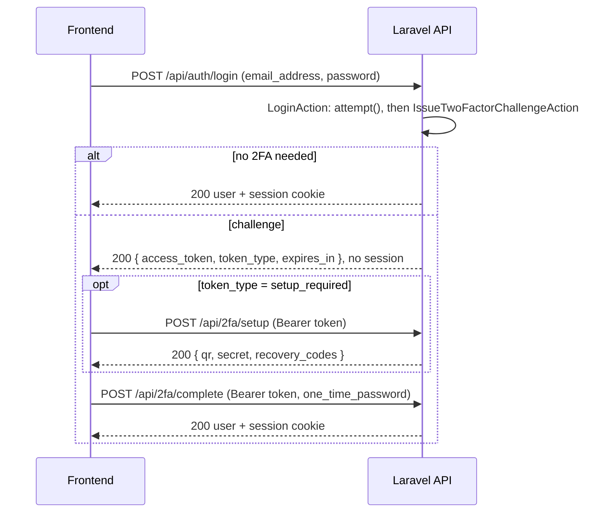

## Two-Factor Authentication (2FA)

TOTP two-factor authentication (Google Authenticator and compatible apps) on top of the
boilerplate's cookie-session login, built on
[antonioribeiro/google2fa-laravel](https://github.com/antonioribeiro/google2fa-laravel).

- **Mandatory by default** (`TWO_FACTOR_AUTHENTICATION_MANDATORY=true`): every user sets 2FA up
  the next time they sign in, and nobody can turn it off.
- **Optional** (`false`): only users who turned 2FA on are asked for a code. They turn it on and
  off from the generated account page, `/account/two-factor`.

### Install

Run `php artisan auth:setup` and pick **Two-Factor Authentication**. It requires
`pragmarx/google2fa-laravel`, `pragmarx/google2fa-qrcode` and `bacon/bacon-qr-code`, then writes
these files, skipping any that already exist. It edits one file it did not write: it appends
`// lightit-auth: two-factor authentication routes` and `require __DIR__ . '/two-factor-auth.php';`
to the end of `routes/api.php`. It skips that when the marker comment is already there, and puts
the original `routes/api.php` back if the write fails.

- **Backend:** the 2FA actions, controllers, requests and resources under `src/Authentication/`,
  `IssueTwoFactorChallengeAction` and `TwoFactorAuthenticatable`, a migration for the 2FA columns
  on `users`, `config/google2fa.php`, `lang/en/google2fa.php` and `routes/two-factor-auth.php`.
- **Frontend:** the 2FA services, an in-memory challenge store, the `/two-factor` and
  `/two-factor/setup` login screens and the `/account/two-factor` page. It looks for the React
  project in a sibling directory named `frontend`, `front` or `<app>-frontend`; pass
  `--frontend-path=<path>` otherwise.

What it cannot do for you is in two checklists. **The steps live there, not on this page:**

| File | Where | What it lists |
| --- | --- | --- |
| `AUTH-2FA-TODO.md` | backend root | Wire the challenge into `LoginAction`, make `User` extend `TwoFactorAuthenticatable`, `migrate`, pick the mode |
| `AUTH-2FA-FRONTEND-TODO.md` | frontend root | Install dependencies, swap the login hook, add the i18n keys, link the account page from the sidebar |

Each one is written for your install (your package manager, your missing dependencies). Tick the
boxes and **delete the file when every box is ticked**: nothing reads it. Running `auth:setup`
again never overwrites it, and warns you while `LoginAction` or `User` still miss their change.
`auth:setup` also prints the same steps when it finishes.

### How it works

1. The boilerplate's `LoginAction` logs the user in, then calls `IssueTwoFactorChallengeAction`.
2. If the user must set up or verify 2FA, that action logs them back out and the login answers
   `200` with a short-lived challenge token instead of the user.
3. The frontend keeps the token in memory (never in storage or the URL) and sends it as
   `Authorization: Bearer` to the challenge endpoints. It is not a session.
4. A valid code (or recovery code) creates the cookie session and returns the boilerplate's
   `UserResource`. Every other login path the package generates goes through the same action.

```mermaid
sequenceDiagram
    participant FE as Frontend
    participant API as Laravel API
    FE->>API: POST /api/auth/login (email_address, password)
    API->>API: LoginAction: attempt(), then IssueTwoFactorChallengeAction
    alt no 2FA needed
        API-->>FE: 200 user + session cookie
    else challenge
        API-->>FE: 200 { access_token, token_type, expires_in }, no session
        opt token_type = setup_required
            FE->>API: POST /api/2fa/setup (Bearer token)
            API-->>FE: 200 { qr, secret, recovery_codes }
        end
        FE->>API: POST /api/2fa/complete (Bearer token, one_time_password)
        API-->>FE: 200 user + session cookie
    end
```

A user who lost their device sends a recovery code to `2fa/verify-recovery-code` instead of
`2fa/complete` (only with a `verification_required` token).

### Configuration

`config/google2fa.php`:

| Key | `.env` | Default | What it does |
| --- | --- | --- | --- |
| `mandatory` | `TWO_FACTOR_AUTHENTICATION_MANDATORY` | `true` | `true`: every user sets 2FA up at login and can't disable it. `false`: only enrolled users are challenged |
| `enabled` | `TWO_FACTOR_AUTHENTICATION_ENABLED` | `true` | `false` challenges nobody, **including enrolled users** (see [Security notes](#security-notes)) |
| `challenge_ttl_minutes` | `TWO_FACTOR_CHALLENGE_TTL_MINUTES` | `15` | Lifetime of the challenge and reset tokens |
| `window` | - | `1` | Accepted clock drift, in 30-second steps. A used code stays blocked for `(2 * window + 1) * 30` s (90 s) |

Fixed in the generated code:

| What | Value | Where |
| --- | --- | --- |
| Per-user lockout | 5 failed codes, then `429` for up to 15 minutes | `TwoFactorAttemptLimiter` |
| `throttle:2fa` (every route but `status`) | 5/min per signed-in user or per challenge token, plus 30/min per IP | `TwoFactorRateLimiter`, registered by the package's service provider |
| Recovery codes | 8 per user | `GenerateRecoveryCodesAction` |

### API reference

Paths are under the boilerplate's `/api` prefix. Errors use the boilerplate's shape,
`{ "error": { "code", "message" } }`. "Token" means the challenge token as `Authorization: Bearer`;
"session" means the cookie session (`auth:sanctum`).

| Method & path | Auth | Request | Success (`200`) | Errors |
| --- | --- | --- | --- | --- |
| `POST 2fa/setup` | `setup_required` token | - | `{ qr, secret, recovery_codes }` | `401` bad or expired token, or 2FA already on; `429` |
| `POST 2fa/complete` | `setup_required` or `verification_required` token | `one_time_password` | `UserResource` + session | `401` token; `422` `invalid_otp`, `otp_already_used`; `429` |
| `POST 2fa/verify-recovery-code` | `verification_required` token | `recovery_code` | `UserResource` + session | `401` token; `422` `invalid_recovery_code`; `429` |
| `GET 2fa/status` | session | - | `{ available, enabled, mandatory }` | - |
| `POST 2fa/enable` | session | `password` | `{ qr, secret }` | `422` `invalid_password`; `409` `2fa_already_configured`, `2fa_unavailable`; `429` |
| `POST 2fa/confirm` | session | `one_time_password` | `{ recovery_codes }` | `422` `invalid_otp`, `otp_already_used`; `409` `2fa_already_configured`, `2fa_not_started`, `2fa_unavailable`; `429` |
| `POST 2fa/regenerate-recovery-codes` | session | `password`, `code` | `{ recovery_codes }` | `422` `invalid_password`, `invalid_otp`, `otp_already_used`; `409` `cannot_regenerate_2fa_unconfigured`; `429` |
| `POST 2fa/disable` | session | `password`, `code` | `{ message }` | `403` `disable_forbidden` (mandatory); `409` `cannot_disable_2fa_unconfigured`; `422` `invalid_password`, `invalid_otp`, `otp_already_used`; `429` |
| `POST 2fa/request-reset` | session | `password` | `{ access_token, token_type: "reset_required", expires_in }` | `422` `invalid_password`; `429` |
| `POST 2fa/reset` | `reset_required` token | - | `{ message }` | `401` token; `429` |

- Every success body is wrapped in `data`.
- `code` on regenerate and disable is a live 6-digit code or a recovery code (which is spent).
- `available` in `status` is `google2fa.enabled`.
- A wrong password is `422`, never `401`, so the frontend doesn't send a signed-in user back to
  `/login`.
- The generated frontend has no screen for `request-reset` / `reset`; build it to fit your own
  account-recovery flow.

### Security notes

- The TOTP secret is stored with Laravel's `encrypted` cast, built into `TwoFactorAuthenticatable`.
  It is tied to `APP_KEY`: rotating it without `APP_PREVIOUS_KEYS` locks enrolled users out.
- Challenge tokens are encrypted payloads with a user id, a reason and an expiry. Each reason only
  opens its own endpoints.
- Recovery codes are stored hashed and are single-use: a used code is removed under a row lock.
- Replay guard: a one-time password is accepted once per user. A second use while it is still
  valid gets `422` `otp_already_used`. This and the lockout need a cache store shared by every app
  server (not `array`).
- `enable`, `confirm` and recovery-code use run under `lockForUpdate()`, so two tabs can't race
  each other into two secrets or two sets of codes.
- `enabled=false` skips the challenge for **everyone, enrolled users included**: they sign in with
  their password alone until it is `true` again (their secret and codes stay stored). To stop
  forcing enrollment but keep challenging enrolled users, set `mandatory=false` instead.
- `attempt()` in `LoginAction` fires Laravel's `Login` event before the challenge. If a listener
  must only run after a completed login, switch `LoginAction` to `validate()`, then the challenge
  action, then `login()` and `session()->regenerate()`.
- Keep the package in `require` (never `--dev`): its service provider registers the `2fa` rate
  limiter on boot, also under `route:cache`.

### Troubleshooting

| Symptom | Cause and fix |
| --- | --- |
| Login lets a 2FA user straight in, no challenge | `LoginAction` doesn't call `IssueTwoFactorChallengeAction` (first box of `AUTH-2FA-TODO.md`), or `TWO_FACTOR_AUTHENTICATION_ENABLED=false`. |
| Every login fails with a `LogicException` | `User` doesn't extend `TwoFactorAuthenticatable` (second box). |
| `2fa/status` or `2fa/enable` answers `401` after a successful login | The session cookie isn't sent back. `SANCTUM_STATEFUL_DOMAINS` must list the frontend's host **with its port** (`localhost:5173`), and `SESSION_DOMAIN` must match the host. |
| `422` `otp_already_used` right after enabling 2FA | The code `confirm` accepted can't be used again for 90 s. Wait for the next code. |
| `/two-factor` sends you back to `/login` | The challenge token lives in memory: a page reload or an expired token drops it. Sign in again. |
