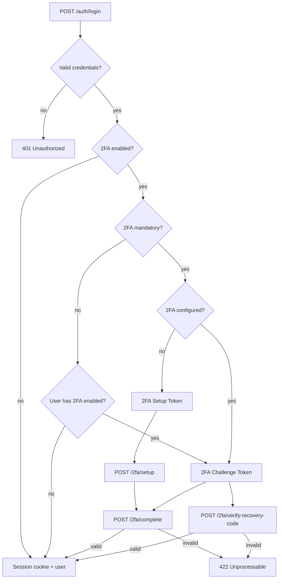
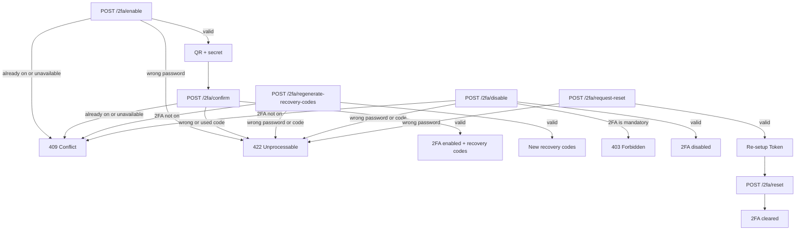

## Google Two-Factor Authentication (2FA)

Enhance account security by enabling Two-Factor Authentication (2FA) using [antonioribeiro/google2fa-laravel](https://github.com/antonioribeiro/google2fa-laravel).

> [!NOTE]
> 2FA support is included at the structural level, but enforcement is not applied by default.

> [!TIP]
> You're free to define how and when 2FA is enforced. Common strategies include two-step login, single-step login, 2FA on sensitive actions, or trusted device recognition. The exact behavior will depend on your project's requirements.

> This package provides the base structure and middleware to support 2FA. Implementation details—such as 2FA token lifetime, logout behavior, or device trust logic—must be defined within your application logic.

### Setup

Run `php artisan auth:setup` and pick **Two-Factor Authentication**. It requires
`pragmarx/google2fa-laravel`, `pragmarx/google2fa-qrcode` and `bacon/bacon-qr-code`, then writes
into your app, skipping every file that already exists:

- the 2FA actions, controllers, requests, resources, `TwoFactorAuthenticatable` and
  `IssueTwoFactorChallengeAction` under `src/Authentication/`
- the migration that adds the 2FA columns to `users`
- `config/google2fa.php` and `lang/en/google2fa.php`
- `routes/two-factor-auth.php`, required from `routes/api.php` (see [Routes](#routes))
- the frontend services and login screens, when it finds the React project (see
  [Login screens](#login-screens)). Pass `--frontend-path=<path>` when it is not a sibling
  directory named `frontend`, `front` or `<app>-frontend`.
- the two checklists described in [After `auth:setup`](#after-authsetup)

The package never edits a file it did not generate, so these steps are yours. They are the
same steps the two checklists list.

#### 1. Wire the challenge action into `LoginAction`

`LoginAction` (`src/Authentication/Domain/Actions/LoginAction.php`) is the boilerplate's, so
inject the challenge action through its constructor. Both classes share a namespace, so there
is no `use` line to add:

```php
public function __construct(
    private readonly AuthFactory $authFactory,
    private readonly IssueTwoFactorChallengeAction $issueTwoFactorChallengeAction,
) {}
```

Then, right after `$request->session()->regenerate();` and before `return $user;` in
`execute()`, call it:

```php
$this->issueTwoFactorChallengeAction->execute($user);
```

The challenge action tears the just-created session back down itself before throwing a
challenge, so the call point only has to be after `attempt()`/`regenerate()` committed the
session and before the user is returned. A user with 2FA configured then gets a `200` with
`token_type: "verification_required"` (or `"setup_required"`) instead of a session on login.

Every other login path this package generates (OTP today; Google SSO and passkeys as they
land) already goes through the same challenge action via `LoginByUserAction::execute()`. This is the only manual
step that puts your own password login through it.

#### 2. Extend `TwoFactorAuthenticatable`

`\Lightit\Users\Domain\Models\User` must extend
`\Lightit\Authentication\Domain\TwoFactorAuthenticatable` instead of
`Illuminate\Foundation\Auth\User`. In `src/Users/Domain/Models/User.php`, replace the
`use Illuminate\Foundation\Auth\User as Authenticatable;` import with
`use Lightit\Authentication\Domain\TwoFactorAuthenticatable;` (kept in alphabetical order with the
other `use` lines) and extend it:

```php
<?php

use Lightit\Authentication\Domain\TwoFactorAuthenticatable;

class User extends TwoFactorAuthenticatable
{
    // Your traits and methods
}
```

Every 2FA stub calls methods (`hasTwoFactorAuthenticationConfigured()`, `getRecoveryCodes()`,
...) that only exist on that class. Without this change `IssueTwoFactorChallengeAction` throws
a `LogicException` on every login instead of challenging anyone. `auth:setup` warns you while
`User` doesn't extend it, and while `LoginAction` doesn't reference the challenge action.

`TwoFactorAuthenticatable` stores the TOTP secret with Laravel's `encrypted` cast, merged with your
model's own `casts()`, so there is no cast to add. Encrypted values are tied to `APP_KEY`: rotating it
without `APP_PREVIOUS_KEYS` leaves enrolled users unable to complete 2FA.

#### 3. Run the migration

```bash
php artisan migrate
```

#### 4. Pick the mode

`config/google2fa.php` reads these from `.env`:

| Variable | Default | What it does |
| --- | --- | --- |
| `TWO_FACTOR_AUTHENTICATION_ENABLED` | `true` | Turns the challenge on or off for everyone |
| `TWO_FACTOR_AUTHENTICATION_MANDATORY` | `true` | `true`: every user sets 2FA up at login. `false`: only users who already set it up are challenged |
| `TWO_FACTOR_CHALLENGE_TTL_MINUTES` | `15` | How long a challenge token lives |

With `mandatory=false`, the challenge action only ever challenges a user who has already set
2FA up (see `IssueTwoFactorChallengeAction::execute()`); it never hands a `setup_required`
token to a user who hasn't enrolled yet. Self-service enrollment from a signed-in session is
not part of this layer.

> [!WARNING]
> `google2fa.enabled=false` (`TWO_FACTOR_AUTHENTICATION_ENABLED`) stops challenging everyone, including
> users who already enrolled: they sign in with their password alone until it is `true` again. Their
> secret and recovery codes stay stored. To stop forcing enrollment but keep challenging enrolled
> users, set `google2fa.mandatory=false` instead.

#### 5. Frontend: use the 2FA-aware login hook

The template's `login()` returns `void`, so its `useLogin` never sees a challenge. In
`src/routes/(public)/_guest/login/-components/login-form.tsx`:

1. Remove `import { useLogin } from "@/services/auth/actions";`
2. Add `import { useTwoFactorLogin } from "../-hooks/use-two-factor-login";` right after
   `import { handleAxiosFieldErrors, redirectTarget } from "@/utils";`
3. Replace `const loginMutation = useLogin();` with `const loginMutation = useTwoFactorLogin();`

Nothing else in the form changes: `loginMutation.mutate(data, { onSuccess, onError })` keeps
its callbacks.

#### 6. Frontend: add the i18n keys

`t()` keys are type-checked against `src/i18n/locales/en.json`, and none of these exist in the
template yet. Add `form.otp` and `form.recoveryCode` under `form`, and the `twoFactor` block at
the top level (then translate them in `es.json`). The exact English strings are the JSON blocks
in `AUTH-2FA-FRONTEND-TODO.md`; this repository keeps them in
`src/Stubs/Frontend/Google2FA/AUTH-2FA-FRONTEND-TODO.md.stub`. The screens also reuse
`login.success`, which the template already has.

#### 7. Frontend: install the dependencies

The screens import `@hookform/resolvers`, `@tanstack/react-query`, `@tanstack/react-router`,
`axios`, `react-hook-form`, `sonner`, `string-ts`, `zod` and `zustand`. The generator never runs
a package manager: the checklist names the missing ones with the add command for the package
manager it detected.

#### Routes

`routes/two-factor-auth.php` registers these; it is written for you.

```php
use Lightit\Authentication\App\Controllers\CompleteTwoFactorAuthenticationController;
use Lightit\Authentication\App\Controllers\ConfirmTwoFactorAuthenticationController;
use Lightit\Authentication\App\Controllers\DisableTwoFactorAuthenticationController;
use Lightit\Authentication\App\Controllers\EnableTwoFactorAuthenticationController;
use Lightit\Authentication\App\Controllers\RegenerateRecoveryCodesController;
use Lightit\Authentication\App\Controllers\ResetTwoFactorAuthenticationController;
use Lightit\Authentication\App\Controllers\SetupTwoFactorAuthenticationController;
use Lightit\Authentication\App\Controllers\ShowTwoFactorAuthenticationStatusController;
use Lightit\Authentication\App\Controllers\RequestTwoFactorResetController;
use Lightit\Authentication\App\Controllers\VerifyRecoveryCodeController;

// Note: apply rate limiting to `complete`, `verify-recovery-code`, and your login route to prevent brute-force attacks.
// The generated routes/two-factor-auth.php already throttles every route except status with `throttle:2fa`;
// that named limiter is registered by lightit-auth-laravel's own service provider on boot,
// not by the routes file, so it keeps working under `php artisan route:cache`. This is why the package must
// stay a runtime dependency (`composer require`, never `--dev`) - its provider has to boot in production.
Route::prefix('2fa')->group(static function (): void {
    Route::post('setup', SetupTwoFactorAuthenticationController::class);
    Route::post('complete', CompleteTwoFactorAuthenticationController::class);
    Route::post('verify-recovery-code', VerifyRecoveryCodeController::class);
    Route::post('reset', ResetTwoFactorAuthenticationController::class);

    Route::middleware('auth:sanctum')->group(static function (): void {
        Route::get('status', ShowTwoFactorAuthenticationStatusController::class);
        Route::post('enable', EnableTwoFactorAuthenticationController::class);
        Route::post('confirm', ConfirmTwoFactorAuthenticationController::class);
        Route::post('disable', DisableTwoFactorAuthenticationController::class);
        Route::post('regenerate-recovery-codes', RegenerateRecoveryCodesController::class);
        Route::post('request-reset', RequestTwoFactorResetController::class);
    });
});
```

### After `auth:setup`

`auth:setup` writes the 2FA files and leaves two checklists in your projects:

| File | Where | What it lists |
| --- | --- | --- |
| `AUTH-2FA-TODO.md` | backend root | Inject the challenge action in `LoginAction`, extend `TwoFactorAuthenticatable`, run `migrate`, pick the mode |
| `AUTH-2FA-FRONTEND-TODO.md` | frontend root | Install dependencies, swap the login hook, add the i18n keys |

The command also prints the same steps when it finishes. Each checklist is generated
for your install (your endpoints, your package manager). Work through it, tick the
boxes, and **delete the file when every box is ticked** — it is not read by the app
and nothing breaks without it. Running `auth:setup` again never overwrites it.

If you lose it, this page has every step in full (see Setup above).

---

### Flow

Login stays the boilerplate's cookie-session login. The challenge token below is not
a session: the frontend holds it in memory and sends it as `Authorization: Bearer`
on the challenge endpoints (`setup`, `complete`, `verify-recovery-code`) and, with the
reset token, on `2fa/reset`. Completing the challenge creates the session
and returns the boilerplate's `UserResource`. The generated frontend screens follow
this flow; see [Login screens](#login-screens).

**First-time setup (mandatory 2FA, secret not configured yet):**

1. `POST /auth/login`
   - Body: `{ "email_address": "...", "password": "..." }`
   - Returns `200`: `{ data: { access_token, token_type: "setup_required", expires_in } }`, no session
2. `POST /2fa/setup`
   - Bearer: setup token
   - Returns: `{ data: { qr, secret, recovery_codes[] } }`
3. `POST /2fa/complete`
   - Bearer: setup token
   - Body: `{ "one_time_password": "..." }`
   - Returns: `UserResource` + session cookie

**Subsequent logins (2FA already configured):**

1. `POST /auth/login`
   - Body: `{ "email_address": "...", "password": "..." }`
   - Returns `200`: `{ data: { access_token, token_type: "verification_required", expires_in } }`, no session
2. `POST /2fa/complete`
   - Bearer: challenge token
   - Body: `{ "one_time_password": "..." }`
   - Returns: `UserResource` + session cookie

**Login with a recovery code (lost authenticator):**

1. `POST /auth/login`, same as above
2. `POST /2fa/verify-recovery-code`
   - Bearer: challenge token
   - Body: `{ "recovery_code": "..." }`
   - Returns: `UserResource` + session cookie

A wrong code returns `422`, an expired or invalid token `401`, and too many failed
attempts `429`.

**Replay protection.** A one-time password is accepted once per user. `VerifyOtpAction`
claims the timestep the code matched with an atomic `Cache::add()` keyed by user and
timestep, kept for as long as the code stays valid (`(2 * window + 1) * 30` seconds). A
second request with the same code - a replay, or two tabs racing - gets `422` with
`error.code` `otp_already_used`; the user waits for the next code, and the generated
2FA screens say so instead of "wrong code". This applies to login
verification, the challenge setup confirmation, the account activation below and the
code that `disable` and `regenerate-recovery-codes` ask for. It needs
a cache store shared by every app server (not `array`), the same store the per-user
lockout already relies on. No schema change.

**Enable 2FA from the account (optional 2FA, `google2fa.mandatory=false`):**

With `mandatory=false` nobody is sent through setup at login, so a signed-in user
enables 2FA from their account page. These requests use the cookie session, no
challenge token.

2FA counts as on when the user has both a secret and `two_factor_auth_activated_at`
(`hasTwoFactorAuthenticationConfigured()`), the same check the login gate uses. `status`,
`enable`, `confirm`, `disable` and `regenerate-recovery-codes` all use that one check.

1. `GET /2fa/status`
   - Auth: cookie session
   - Returns: `{ data: { available, enabled, mandatory } }` (the boilerplate's `UserResource` has no 2FA flag)
   - `available` is `google2fa.enabled`: when it is `false`, login never challenges anyone, so there is nothing to turn on
2. `POST /2fa/enable`
   - Auth: cookie session
   - Body: `{ "password": "..." }`
   - Stores a new secret, not active yet, and returns: `{ data: { qr, secret } }`. A secret that was never confirmed is replaced
   - Returns `409` (`2fa_already_configured`) if 2FA is already on: an active secret is never overwritten
   - Returns `409` (`2fa_unavailable`) if `google2fa.enabled` is `false`
3. `POST /2fa/confirm`
   - Auth: cookie session
   - Body: `{ "one_time_password": "..." }`
   - Sets `two_factor_auth_activated_at` and returns: `{ data: { recovery_codes[] } }`, shown once
   - Returns `422` for a wrong or already-used code, `429` after 5 attempts, `409` if 2FA is already on or `enable` was never called, and `409` (`2fa_unavailable`) if `google2fa.enabled` is `false`

`enable` and `confirm` re-check and write the user row under a row lock (`lockForUpdate()`),
so an `enable` from another tab can't swap the secret while `confirm` activates it (`confirm`
then answers `422`), and two concurrent `confirm`s can't both hand out recovery codes. The
lockout count and the code check run before the transaction, so a `database` cache store on
the same connection doesn't roll a failed attempt back.

A code accepted by `confirm` stays claimed for the rest of its validity window (replay
protection above), so signing in right after with that same code gets `422`
`otp_already_used` on `complete`: wait for the next code.

`enable`, `confirm`, `disable`, `regenerate-recovery-codes` and `request-reset` are
throttled with `throttle:2fa`, keyed by the signed-in user: they share one bucket of 5
requests a minute per user (plus 30 a minute per IP), so a user's `enable` and `confirm`
count against the same 5. A bearer token sent to these routes does not change the key:
the session authenticates them, so a made-up `Authorization` header can't open a fresh
bucket. Only the challenge routes, which have no signed-in user, are keyed by their
challenge token.

The generated frontend drives these calls from `/account/two-factor`, a page under the
`_private` layout: turn on (password, QR code, first code, recovery codes shown once),
regenerate recovery codes (password and a code, new codes) and turn off (password and a
code; hidden while
`mandatory` is `true`, and a `403` gets its own message). When `status` says 2FA is not
`available`, the page only says so and offers no action. The dialogs that show recovery
codes can only be closed with their "I've saved my recovery codes" button. It writes:

- `src/routes/_private/account/two-factor/page.tsx`
- `src/routes/_private/account/two-factor/-components/enable-two-factor-dialog.tsx`
- `src/routes/_private/account/two-factor/-components/confirm-two-factor-form.tsx`
- `src/routes/_private/account/two-factor/-components/regenerate-recovery-codes-dialog.tsx`
- `src/routes/_private/account/two-factor/-components/disable-two-factor-dialog.tsx`
- `src/routes/_private/account/two-factor/-components/password-confirmation-form.tsx`
- `src/routes/_private/account/two-factor/-components/second-factor-confirmation-form.tsx`
- `src/routes/_private/account/two-factor/-hooks/use-two-factor-account-errors.ts`
- `src/components/two-factor/authenticator-secret.tsx` and `src/components/two-factor/recovery-codes.tsx`, shared with the login setup screen

The generated `AUTH-2FA-FRONTEND-TODO.md` lists every frontend file, the i18n keys to add
and an optional sidebar link.

A wrong password on any password-confirmed request below (and on `enable`) returns
`422` (`invalid_password`), not `401`: the user is still signed in, and the frontend
sends every `401` back to the login screen.

**Reset 2FA (while logged in):**

1. `POST /2fa/request-reset`
   - Auth: cookie session
   - Body: `{ "password": "..." }`
   - Returns: `{ data: { access_token, token_type: "reset_required", expires_in } }`
2. `POST /2fa/reset`
   - Bearer: reset token
   - Returns: `{ data: { message } }`

**Second factor on regenerate and disable.** Both take the password and a `code`, so a
password and a signed-in session alone can't strip or replace the second factor. A
6-digit `code` is checked as a live one-time password, with the replay protection above;
anything else is checked as a recovery code, and a matching one is spent. The password is
checked first. A wrong code returns `422` with `error.code` `invalid_otp` (`otp_already_used`
for a replayed one) and counts toward the same per-user lockout as login: `429` after 5
failed attempts, cleared by a valid code. The attempt is counted before, and outside, the
transaction that spends a recovery code, so a `database` cache store keeps the count.

**Regenerate recovery codes:**

1. `POST /2fa/regenerate-recovery-codes`
   - Auth: cookie session
   - Body: `{ "password": "...", "code": "..." }`
   - Returns: `{ data: { recovery_codes[] } }`
   - Returns `422` for a wrong password or code, `429` after 5 failed codes
   - Returns `409` (`cannot_regenerate_2fa_unconfigured`) if 2FA is not on

**Disable 2FA:**

1. `POST /2fa/disable`
   - Auth: cookie session
   - Body: `{ "password": "...", "code": "..." }`
   - Returns: `{ data: { message } }`
   - Returns `422` for a wrong password or code, `429` after 5 failed codes
   - Returns `403 Forbidden` if `google2fa.mandatory` is `true`
   - Returns `409` (`cannot_disable_2fa_unconfigured`) if 2FA is not on

**Logging in**


```mermaid
flowchart TD
    Login[POST /auth/login] --> ValidateCreds{Valid credentials?}
    ValidateCreds -- no --> E401[401 Unauthorized]
    ValidateCreds -- yes --> AppHas2FA{2FA enabled?}

    AppHas2FA -- no --> Session[Session cookie + user]
    AppHas2FA -- yes --> IsMandatory{2FA mandatory?}

    IsMandatory -- no --> UserHas2FA{User has 2FA enabled?}
    UserHas2FA -- no --> Session
    UserHas2FA -- yes --> ChallengeToken[2FA Challenge Token]

    IsMandatory -- yes --> IsSetup{2FA configured?}
    IsSetup -- no --> SetupToken[2FA Setup Token]
    IsSetup -- yes --> ChallengeToken

    SetupToken --> Setup[POST /2fa/setup]
    Setup --> Complete[POST /2fa/complete]

    ChallengeToken --> Complete
    ChallengeToken --> RecoveryCode[POST /2fa/verify-recovery-code]

    Complete -- invalid --> E422[422 Unprocessable]
    Complete -- valid --> Session
    RecoveryCode -- invalid --> E422
    RecoveryCode -- valid --> Session
```

**Managing 2FA once logged in.** These are separate requests made later, each
authenticated with the cookie session above and confirmed with the account password;
regenerate and disable also need a one-time password or a recovery code.


```mermaid
flowchart TD
    Enable[POST /2fa/enable] -- already on or unavailable --> E409[409 Conflict]
    Enable -- wrong password --> E422[422 Unprocessable]
    Enable -- valid --> Secret[QR + secret]
    Secret --> Confirm[POST /2fa/confirm]
    Confirm -- already on or unavailable --> E409
    Confirm -- wrong or used code --> E422
    Confirm -- valid --> Enabled[2FA enabled + recovery codes]

    Regenerate[POST /2fa/regenerate-recovery-codes] -- 2FA not on --> E409
    Regenerate -- wrong password or code --> E422
    Regenerate -- valid --> NewCodes[New recovery codes]

    Disable[POST /2fa/disable] -- 2FA is mandatory --> E403[403 Forbidden]
    Disable -- 2FA not on --> E409
    Disable -- wrong password or code --> E422
    Disable -- valid --> Disabled[2FA disabled]

    RequestReset[POST /2fa/request-reset] -- wrong password --> E422
    RequestReset -- valid --> ResetToken[Re-setup Token]
    ResetToken --> Reset[POST /2fa/reset]
    Reset --> Cleared[2FA cleared]
```

### Login screens

The frontend layer covers the 2FA services, an in-memory challenge store and the two login
screens (verification and setup). It writes:

| File | Contents |
| --- | --- |
| `src/services/auth/two-factor/types.ts` | Response/payload types, the `TwoFactorChallengeResult` discriminant and its guards |
| `src/services/auth/two-factor/schemas.ts` | OTP, recovery-code and password zod schemas |
| `src/services/auth/two-factor/api.ts` | `loginWithTwoFactorChallenge` plus one function per 2FA endpoint; the challenge-token endpoints attach a manual `Authorization: Bearer` header and set `isAuthProbe`, the session endpoints call the app's normal cookie-authenticated client |
| `src/services/auth/two-factor/actions.ts` | `useTwoFactorSetup` (a query keyed by the challenge token, fetched once), `removeTwoFactorSetupQueries`, and `useMutation`-based hooks for the other endpoints |
| `src/stores/use-two-factor-challenge-store.ts` | Non-persisted zustand store holding the challenge token, its type and its expiry |
| `src/routes/(public)/_guest/login/-hooks/use-two-factor-login.ts` | `useTwoFactorLogin`, a replacement for `useLogin()` (no hook-level props) whose `mutate` and `mutateAsync` route a challenge to the 2FA screens |
| `src/routes/(public)/_guest/two-factor/page.tsx` | `/two-factor`: 6-digit code, with a switch to a recovery code |
| `src/routes/(public)/_guest/two-factor/setup/page.tsx` | `/two-factor/setup`: QR code, manual-entry key, recovery codes and the first code |
| `src/routes/(public)/_guest/two-factor/-components/one-time-password-form.tsx` | Code form shared by both screens (`completeTwoFactor`) |
| `src/routes/(public)/_guest/two-factor/-components/recovery-code-form.tsx` | Recovery-code form (`verifyRecoveryCode`), verification screen only |
| `src/routes/(public)/_guest/two-factor/-components/recovery-codes.tsx` | Recovery-code list with a copy-to-clipboard button |
| `src/routes/(public)/_guest/two-factor/-hooks/use-two-factor-completion.ts` | What both forms do on success and on error |

The TanStack Router plugin adds the two routes to `src/routeTree.gen.ts` the next time `vite`
runs (`dev` or `build`). Type-check after that.

**How the flow works**

1. `useTwoFactorLogin` posts the credentials to `auth/login` through the shared `api` (after
   `ensureCsrf()`). A normal login drops any earlier challenge from the store, fetches the
   current user again and then runs the login form's own `onSuccess`, exactly like `useLogin`.
2. A challenge response (`200` with `token_type` `verification_required` or `setup_required`)
   skips the form's `onSuccess`: the token goes into the in-memory store and the user is sent
   to `/two-factor` or `/two-factor/setup`, keeping the `redirect` search param. The token never
   goes into the URL, `localStorage` or `sessionStorage`; a page reload drops it and the user
   signs in again. `mutateAsync` routes a challenge the same way and resolves with it (`null`
   after a normal login).
3. Both screens redirect to `/login` when the store holds no unexpired token of the right type.
   "Back to sign in" clears the store.
4. The setup screen calls `setupTwoFactor` once per token. `useTwoFactorSetup` is a query with
   `staleTime: Infinity` and `retry: false`, so StrictMode's double mount does not generate a
   second secret. Its key (`["twoFactorSetup", token]`) sits outside the `auth` query keys, so
   invalidating `["auth"]` does not post `2fa/setup` again and rotate the secret behind the QR
   code. `gcTime: 0` drops the secret and the recovery codes from the cache as soon as the
   screen unmounts.
5. On success (code or recovery code) the backend creates the cookie session and returns the
   user. The screen fetches the current-user query again, navigates to `redirect` (or `/`),
   clears the store and removes the setup query.
6. When a code submission fails: `401` means the token expired or is no longer valid, so the
   store is cleared and the user goes back to `/login`. A wrong code (`422`) or a lockout
   (`429`) shows the error under the code field and keeps the user on the screen. Any other
   failure (a `500`, a network error) shows a generic error toast.
7. When the setup screen can't load (`2fa/setup` fails), it shows an error. Both screens always
   show the "Back to sign in" link.

**Frontend API contract**

| Function | Path | Auth | Notes |
| --- | --- | --- | --- |
| `loginWithTwoFactorChallenge` | `auth/login` | credentials | Returns the challenge, or `null` when the backend logged the user in directly |
| `setupTwoFactor` | `2fa/setup` | challenge token | Returns the QR SVG, the manual-entry secret, and the recovery codes |
| `completeTwoFactor` | `2fa/complete` | challenge token | Serves both setup-confirm and login-verify; creates the session and returns the user |
| `verifyRecoveryCode` | `2fa/verify-recovery-code` | challenge token | Lost-device path; creates the session and returns the user, same as `completeTwoFactor` |
| `requestTwoFactorReset` | `2fa/request-reset` | cookie session | Re-validates the password before issuing a reset challenge token |
| `resetTwoFactor` | `2fa/reset` | reset challenge token | Clears the secret; the user re-enrolls through setup afterward |
| `disableTwoFactor` | `2fa/disable` | cookie session | Fails with 403 when `google2fa.mandatory` is `true` on the backend - surface that error, don't hide the button |
| `regenerateRecoveryCodes` | `2fa/regenerate-recovery-codes` | cookie session | No dedicated screen shipped; wire it into wherever your settings page lives |

Recovery-code verification and regeneration live under `/2fa/*`, not `/auth/*`; the generated
routes file follows that grouping, so these are the paths that are live once
`two-factor-auth.php` is required.

**Screens still to build**

- **Disable 2FA (self-service)** - a password-confirmation form calling `disableTwoFactor`,
  handling the 403 `mandatory` case above instead of assuming the action always succeeds.
- **Regenerate recovery codes** - a password-confirmation form calling
  `regenerateRecoveryCodes`.
- **Reset flow** - `requestTwoFactorReset` (password confirm, while still holding a cookie
  session) followed by `resetTwoFactor` (spends the resulting challenge token) is a two-step
  flow; design it to fit your own account-recovery patterns.

### Challenge tokens and rate limiting

Each challenge token only completes the endpoint its reason was issued for: a `setup_required`
or `verification_required` token both unlock `/2fa/complete` (the token used for `/2fa/setup`
also confirms enrollment right after), but only a `verification_required` token unlocks
`/2fa/verify-recovery-code`. The token is valid until its TTL expires:
`google2fa.challenge_ttl_minutes` in `config/google2fa.php`.

`routes/two-factor-auth.php` throttles `setup`, `complete`, `verify-recovery-code` and `reset`
with `throttle:2fa`. `lightit-auth-laravel`'s own service provider registers that named limiter
in `boot()` when `\Lightit\Authentication\Domain\TwoFactorRateLimiter` exists, so there is no
`AppServiceProvider` paste, and it still runs under `php artisan route:cache`, unlike a
file-scope call in the routes file would. This is why `lightit-auth-laravel` must stay a
runtime dependency (`composer require`, never `--dev`): its provider has to boot in production
for the limiter to exist.

### Optional: avoid the `Login` event side effect

`$guard->attempt()` fires Laravel's `Login` event even for a user who is about to be
challenged. If your listeners on that event should only run for a fully authenticated session,
swap `attempt()` for `validate()` + the challenge action + `login()` in `LoginAction`:

```php
if (! $request->hasSession()) {
    throw new UnauthenticatedException;
}

if (! $guard->validate(['email' => $credentials->email, 'password' => $credentials->password])) {
    throw new UnauthenticatedException;
}

/** @var User $user */
$user = $guard->getLastAttempted();

$this->issueTwoFactorChallengeAction->execute($user);

$guard->login($user);
$request->session()->regenerate();
```

`validate()` checks the credentials without logging the user in, so the challenge action runs
first and the session is only established once the challenge (if any) is cleared. `login()`
does what `attempt()` used to, and `regenerate()` still runs after it.

---
