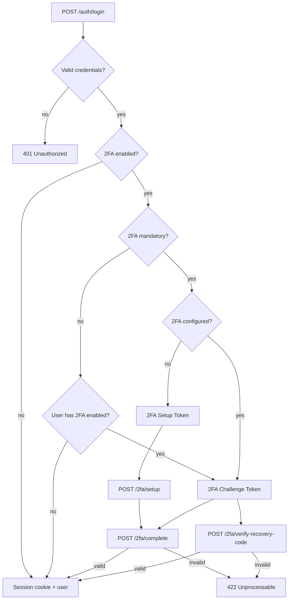
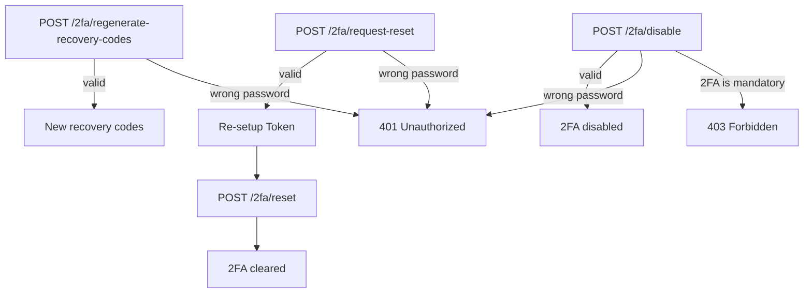

## Google Two-Factor Authentication (2FA)

Enhance account security by enabling Two-Factor Authentication (2FA) using [antonioribeiro/google2fa-laravel](https://github.com/antonioribeiro/google2fa-laravel).

> [!NOTE]
> 2FA support is included at the structural level, but enforcement is not applied by default.

> [!TIP]
> You're free to define how and when 2FA is enforced. Common strategies include two-step login, single-step login, 2FA on sensitive actions, or trusted device recognition. The exact behavior will depend on your project's requirements.

> This package provides the base structure and middleware to support 2FA. Implementation details—such as 2FA token lifetime, logout behavior, or device trust logic—must be defined within your application logic.

### Setup

#### 1. Install the package

The 2FA package is automatically installed when selected during `auth:setup`.

#### 2. Extend your User model

Your `User` model must extend `TwoFactorAuthenticatable`:

```php
<?php

use Lightit\Authentication\Domain\TwoFactorAuthenticatable;

class User extends TwoFactorAuthenticatable
{
    // Your traits and methods
}
```

`TwoFactorAuthenticatable` stores the TOTP secret with Laravel's `encrypted` cast, merged with your
model's own `casts()`, so there is no cast to add. Encrypted values are tied to `APP_KEY`: rotating it
without `APP_PREVIOUS_KEYS` leaves enrolled users unable to complete 2FA.

#### 3. Ensure `UnauthorizedException` exists

The 2FA stubs depend on `Lightit\Shared\App\Exceptions\Http\UnauthorizedException`. If your app doesn't have it yet, create it:

```php
<?php

declare(strict_types=1);

namespace Lightit\Shared\App\Exceptions\Http;

class UnauthorizedException extends HttpException
{
    /**
     * An HTTP status code.
     */
    protected int $status = 401;

    /**
     * An error code.
     */
    protected string $errorCode = 'unauthorized';
}
```

#### 4. Configure the authentication guard

Use the guard the boilerplate already configures for its own login flow; this package does not add one.

#### 5. Wire the challenge action into `LoginAction`

This package cannot edit a login it does not generate, so `LoginAction` needs the
challenge action injected through its constructor:

```php
public function __construct(
    private readonly AuthFactory $authFactory,
    private readonly IssueTwoFactorChallengeAction $issueTwoFactorChallengeAction,
) {}
```

Then, right after `$request->session()->regenerate();` and before `return $user;`
in `execute()`, call it:

```php
$this->issueTwoFactorChallengeAction->execute($user);
```

The challenge action tears the just-created session back down itself before
throwing a challenge, so a user with 2FA configured gets a `200` with
`token_type: "verification_required"` (or `"setup_required"`) instead of a
session on login. See the generated `AUTH-2FA-TODO.md` for the full detail.

#### 6. Define 2FA-related routes

```php
use Lightit\Authentication\App\Controllers\CompleteTwoFactorAuthenticationController;
use Lightit\Authentication\App\Controllers\DisableTwoFactorAuthenticationController;
use Lightit\Authentication\App\Controllers\RegenerateRecoveryCodesController;
use Lightit\Authentication\App\Controllers\ResetTwoFactorAuthenticationController;
use Lightit\Authentication\App\Controllers\SetupTwoFactorAuthenticationController;
use Lightit\Authentication\App\Controllers\RequestTwoFactorResetController;
use Lightit\Authentication\App\Controllers\VerifyRecoveryCodeController;

// Note: apply rate limiting to `complete`, `verify-recovery-code`, and your login route to prevent brute-force attacks.
// The generated routes/two-factor-auth.php already throttles setup/complete/verify-recovery-code/reset with
// `throttle:2fa`; that named limiter is registered by lightit-auth-laravel's own service provider on boot,
// not by the routes file, so it keeps working under `php artisan route:cache`. This is why the package must
// stay a runtime dependency (`composer require`, never `--dev`) - its provider has to boot in production.
Route::prefix('2fa')->group(static function (): void {
    Route::post('setup', SetupTwoFactorAuthenticationController::class);
    Route::post('complete', CompleteTwoFactorAuthenticationController::class);
    Route::post('verify-recovery-code', VerifyRecoveryCodeController::class);
    Route::post('reset', ResetTwoFactorAuthenticationController::class);

    Route::middleware('auth:sanctum')->group(static function (): void {
        Route::post('disable', DisableTwoFactorAuthenticationController::class);
        Route::post('regenerate-recovery-codes', RegenerateRecoveryCodesController::class);
        Route::post('request-reset', RequestTwoFactorResetController::class);
    });
});
```

> [!WARNING]
> `google2fa.enabled=false` (`TWO_FACTOR_AUTHENTICATION_ENABLED`) stops challenging everyone, including
> users who already enrolled: they sign in with their password alone until it is `true` again. Their
> secret and recovery codes stay stored. To stop forcing enrollment but keep challenging enrolled
> users, set `google2fa.mandatory=false` instead.

---

### Flow

Login stays the boilerplate's cookie-session login. The challenge token below is not
a session: the frontend holds it in memory and sends it as `Authorization: Bearer`
on the challenge endpoints (`setup`, `complete`, `verify-recovery-code`) and, with the
reset token, on `2fa/reset`. Completing the challenge creates the session
and returns the boilerplate's `UserResource`. The generated frontend screens follow
this flow; see the generated `AUTH-2FA-FRONTEND-TODO.md`.

**First-time setup (mandatory 2FA, secret not configured yet):**

1. `POST /auth/login`
   - Body: `{ "email_address": "...", "password": "..." }`
   - Returns `200`: `{ data: { access_token, token_type: "setup_required", expires_in } }`, no session
2. `POST /2fa/setup`
   - Bearer: setup token
   - Returns: `{ data: { qr, secret, recovery_codes[] } }`
3. `POST /2fa/complete`
   - Bearer: setup token
   - Body: `{ "one_time_password": "..." }`
   - Returns: `UserResource` + session cookie

**Subsequent logins (2FA already configured):**

1. `POST /auth/login`
   - Body: `{ "email_address": "...", "password": "..." }`
   - Returns `200`: `{ data: { access_token, token_type: "verification_required", expires_in } }`, no session
2. `POST /2fa/complete`
   - Bearer: challenge token
   - Body: `{ "one_time_password": "..." }`
   - Returns: `UserResource` + session cookie

**Login with a recovery code (lost authenticator):**

1. `POST /auth/login`, same as above
2. `POST /2fa/verify-recovery-code`
   - Bearer: challenge token
   - Body: `{ "recovery_code": "..." }`
   - Returns: `UserResource` + session cookie

A wrong code returns `422`, an expired or invalid token `401`, and too many failed
attempts `429`.

**Replay protection.** A one-time password is accepted once per user. `VerifyOtpAction`
claims the timestep the code matched with an atomic `Cache::add()` keyed by user and
timestep, kept for as long as the code stays valid (`(2 * window + 1) * 30` seconds). A
second request with the same code - a replay, or two tabs racing - gets `422` with
`error.code` `otp_already_used`; the user waits for the next code, and the generated
2FA screens say so instead of "wrong code". This applies to login
verification, the challenge setup confirmation and the account activation below. It needs
a cache store shared by every app server (not `array`), the same store the per-user
lockout already relies on. No schema change.

**Reset 2FA (while logged in):**

1. `POST /2fa/request-reset`
   - Auth: cookie session
   - Body: `{ "password": "..." }`
   - Returns: `{ data: { access_token, token_type: "reset_required", expires_in } }`
2. `POST /2fa/reset`
   - Bearer: reset token
   - Returns: `{ data: { message } }`

**Regenerate recovery codes:**

1. `POST /2fa/regenerate-recovery-codes`
   - Auth: cookie session
   - Body: `{ "password": "..." }`
   - Returns: `{ data: { recovery_codes[] } }`

**Disable 2FA:**

1. `POST /2fa/disable`
   - Auth: cookie session
   - Body: `{ "password": "..." }`
   - Returns: `{ data: { message } }`
   - Returns `403 Forbidden` if `google2fa.mandatory` is `true`

**Logging in**


```mermaid
flowchart TD
    Login[POST /auth/login] --> ValidateCreds{Valid credentials?}
    ValidateCreds -- no --> E401[401 Unauthorized]
    ValidateCreds -- yes --> AppHas2FA{2FA enabled?}

    AppHas2FA -- no --> Session[Session cookie + user]
    AppHas2FA -- yes --> IsMandatory{2FA mandatory?}

    IsMandatory -- no --> UserHas2FA{User has 2FA enabled?}
    UserHas2FA -- no --> Session
    UserHas2FA -- yes --> ChallengeToken[2FA Challenge Token]

    IsMandatory -- yes --> IsSetup{2FA configured?}
    IsSetup -- no --> SetupToken[2FA Setup Token]
    IsSetup -- yes --> ChallengeToken

    SetupToken --> Setup[POST /2fa/setup]
    Setup --> Complete[POST /2fa/complete]

    ChallengeToken --> Complete
    ChallengeToken --> RecoveryCode[POST /2fa/verify-recovery-code]

    Complete -- invalid --> E422[422 Unprocessable]
    Complete -- valid --> Session
    RecoveryCode -- invalid --> E422
    RecoveryCode -- valid --> Session
```

**Managing 2FA once logged in.** These are separate requests made later, each
authenticated with the cookie session above and confirmed with the account password.


```mermaid
flowchart TD
    Regenerate[POST /2fa/regenerate-recovery-codes] -- wrong password --> E401[401 Unauthorized]
    Regenerate -- valid --> NewCodes[New recovery codes]

    Disable[POST /2fa/disable] -- 2FA is mandatory --> E403[403 Forbidden]
    Disable -- wrong password --> E401
    Disable -- valid --> Disabled[2FA disabled]

    RequestReset[POST /2fa/request-reset] -- wrong password --> E401
    RequestReset -- valid --> ResetToken[Re-setup Token]
    ResetToken --> Reset[POST /2fa/reset]
    Reset --> Cleared[2FA cleared]
```

---
