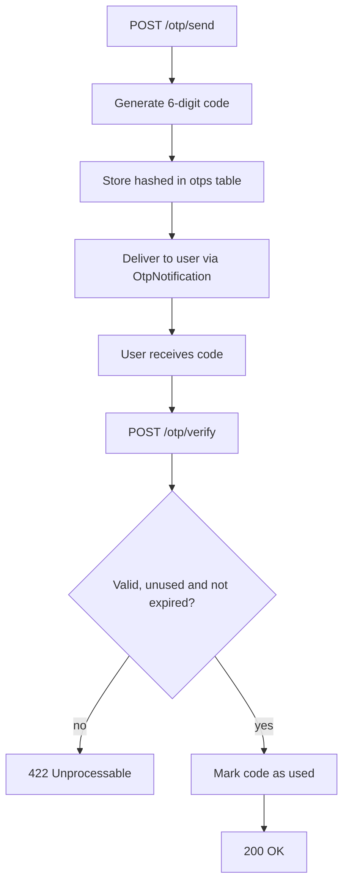

## OTP (One-Time Password)

Email-based one-time password delivery for identity verification.


### Setup

#### 1. Install the feature

The OTP flow is automatically installed when selected during `auth:setup`.

 > Note: The generated `OtpVerifyController` issues API tokens using your configured token driver.  
 > OTP therefore **requires** either JWT or Sanctum to be installed and enabled.  
 > The `auth:setup` command enforces this by asking you to choose a token driver when you enable OTP.
 
#### 2. Run the migration

```bash
php artisan migrate
```

This creates the `otps` table.

#### 3. Define routes

```php
use Lightit\Authentication\App\Controllers\OtpSendController;
use Lightit\Authentication\App\Controllers\OtpVerifyController;

Route::prefix('otp')->group(static function () {
    Route::post('send', OtpSendController::class);
    Route::post('verify', OtpVerifyController::class);
});
```

---

### Flow

1. `POST /otp/send`
   - Body: `{ "email": "..." }`
   - Returns: `200` — generates a 6-digit code, stores it hashed in the `otps` table, and delivers it to the user via `OtpNotification`
   - Any existing codes for the same destination are deleted before creating the new one

2. User receives the code (via email by default)

3. `POST /otp/verify`
   - Body: `{ "email": "...", "code": "123456" }`
   - Returns: `200` on success
   - Returns: `422` if the code is invalid, already used, or expired



