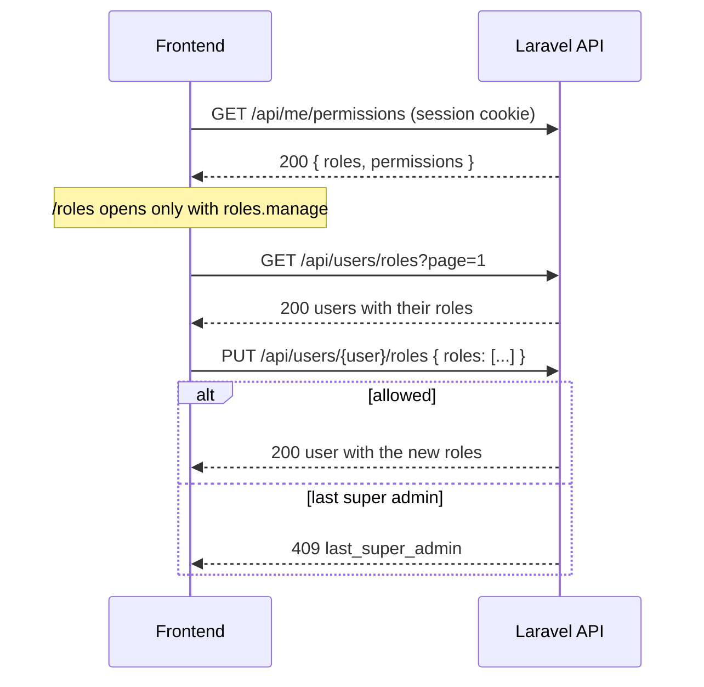

## Roles and Permissions

Role-based access on top of the boilerplate's cookie-session login, built on
[spatie/laravel-permission](https://github.com/spatie/laravel-permission). An admin assigns roles
to users from the app, and the frontend shows or hides what each user can reach. Roles and the
permissions each one grants live in code and seeders; there is no screen to create them.

- **Three roles:** `user` (no permissions), `admin` (every `users.*` permission plus
  `roles.manage`) and `super-admin` (every permission, and through `Gate::before` every check).
- **One management permission:** `roles.manage` opens the roles API and the `/roles` admin page.

### Install

Run `php artisan auth:setup` and pick **Roles and Permissions**. It requires
`spatie/laravel-permission`, then writes these files, skipping any that already exist (it never
edits a file it did not write):

- **Backend:** `config/permission.php` and spatie's migration; the catalog in `src/Shared/`
  (`UserPermissions`, `RolePermissions`, `PermissionManagement`, `RoleManagement`) with
  `RoleSeeder` and `PermissionSeeder`; the roles API under `src/Roles/` and `routes/roles.php`
  (required from `routes/api.php` for you).
- **Frontend:** the permission helpers in `src/services/permissions/`, the roles services in
  `src/services/roles/`, `<Can>` in `src/components/permissions/can.tsx` and the `/roles` page under
  `src/routes/_private/roles/`. It looks for the React project in a sibling directory named
  `frontend`, `front` or `<app>-frontend`; pass `--frontend-path=<path>` otherwise.

What it cannot do for you is in two checklists. **The steps live there, not on this page:**

| File | Where | What it lists |
| --- | --- | --- |
| `AUTH-ROLES-TODO.md` | backend root | Add `HasRoles` to `User`, paste the `Gate::before` line, `migrate`, seed the roles, make your first super admin |
| `AUTH-ROLES-FRONTEND-TODO.md` | frontend root | Install dependencies, add the i18n keys, link the roles page from the sidebar |

Each one is written for your install (your package manager, your missing dependencies). Tick the
boxes and **delete the file when every box is ticked**: nothing reads it. Running `auth:setup`
again never overwrites it, and warns you while `User` still misses `HasRoles`.
`auth:setup` also prints the same steps when it finishes.

### How it works

1. The frontend reads `GET /me/permissions` once per signed-in user and caches it. `<Can>`,
   `usePermissions()` and `ensurePermission()` answer from that list.
2. `/roles` runs `ensurePermission(PERMISSIONS.manageRoles)` in `beforeLoad`: without
   `roles.manage` the user is sent to `/`, even when they type the URL.
3. The page lists users with their roles and edits them in a dialog that sends
   `PUT /users/{user}/roles` with the full list. The backend checks the permission again on every
   request; the frontend only hides what the user can't use.

The permissions query is keyed by the user id, so another user signing in never reads the
previous user's list, and the template's logout already clears the whole query cache. Saving
roles refetches the list and the signed-in user's permissions.

### Configuration

- **Catalog:** add a permission as a constant (`UserPermissions`, `RolePermissions` or a class of
  your own), list it in `PermissionManagement::PERMISSIONS`, grant it in `RoleManagement::listFor()`
  and run `php artisan db:seed --class=RoleSeeder` again. The seeders only add; they never delete.
- **Frontend constant:** `PERMISSIONS` in `src/services/permissions/constants.ts` mirrors the
  permissions the frontend checks. Add yours there too.
- **Spatie:** `config/permission.php` is spatie's own file (table names, cache). The roles API
  reads the roles table name from it and the guard from spatie (`web` in the boilerplate).
- **Rate limit:** every route in `routes/roles.php` is throttled at 60 requests a minute per user.

### API reference

Paths are under the boilerplate's `/api` prefix, all behind `auth:sanctum` (the cookie session).
Every success body is wrapped in `data`.

| Method & path | Permission | Request | Success (`200`) | Errors |
| --- | --- | --- | --- | --- |
| `GET me/permissions` | - | - | `{ roles: string[], permissions: string[] }` | `401` |
| `GET roles` | `roles.manage` | - | `[{ id, name }]` | `401`, `403` |
| `GET users/roles` | `roles.manage` | `page` | paginated `[{ id, name, email_address, roles }]` | `401`, `403` |
| `PUT users/{user}/roles` | `roles.manage` | `roles: string[]` (may be empty) | `{ id, name, email_address, roles }` | `401`, `403`, `404`, `409` `last_super_admin`, `422`, `429` |

- `roles` replaces the user's roles; each name must exist for the app's guard.
- A missing `roles.manage` is spatie's `403` (`{ message }`). A non-super admin who tries to grant
  or revoke `super-admin` gets `403` with `error.code` `super_admin_role_change_forbidden`.
- `GET users/roles` eager-loads the roles: the same number of queries whatever the page size.

### Security notes

- Authorization is enforced by the backend: spatie's `PermissionMiddleware` on the routes and
  `SyncUserRolesRequest::authorize()` for the super admin rule. `<Can>` and `ensurePermission()`
  are UX only.
- Only a super admin can grant or revoke `super-admin`, so an admin with `roles.manage` can't
  promote themselves.
- The last super admin can't lose the role, not even by editing their own roles. The check locks
  the super admin rows inside a transaction, so two simultaneous demotions can't both pass.
- `Gate::before` lets a super admin through every `can()` check, the boilerplate's `UserPolicy`
  included. `/me/permissions` still lists only the permissions the user really has, so seed new
  permissions to show super admins the matching UI.

### Troubleshooting

| Symptom | Cause and fix |
| --- | --- |
| `me/permissions` answers `500` with `Call to undefined method ...getRoleNames()` | `User` doesn't use `HasRoles` (first box of `AUTH-ROLES-TODO.md`). |
| Every management route answers `403` for an admin | The roles weren't seeded, or your `PermissionManagement.php` predates `RolePermissions::MANAGE` (`auth:setup` warns). Add it to the catalog and run `php artisan db:seed --class=RoleSeeder`. |
| A new permission is ignored right after seeding | Spatie caches permissions. Run `php artisan permission:cache-reset`. |
| The **Roles** link doesn't show for a super admin | The sidebar step of `AUTH-ROLES-FRONTEND-TODO.md` is missing, or the super admin role has no `roles.manage` because the seeder didn't run after the catalog changed. |
| `PUT users/{user}/roles` answers `422` for a role that exists | The role was created for another guard. Create it with `Role::findOrCreate('name')` so it gets the app's guard. |
